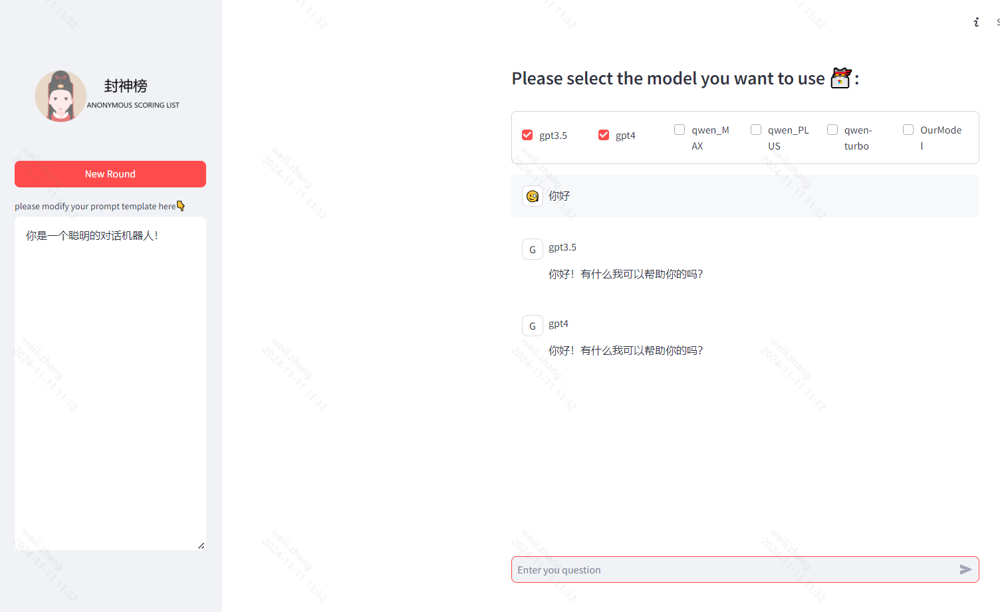

# 项目说明
一个支持同时调用多个大模型的web项目，你可以动态配置自己的prompt
# 文件目录
1. models.py定义了各个模型的方法调用

你可以在web.py中的model_pool添加你的模型名称，然后在models.py中添加你的模型调用
2. web.py文件

项目入口文件，定义了页面的相关配置与显示

# 启动命令：
streamlit run .\web.py

# 页面展示

